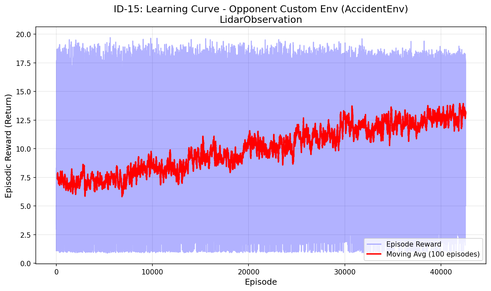
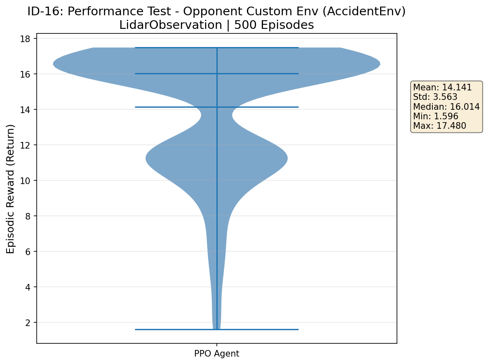

# AccidentEnv PPO Agent

PPO training and evaluation for `AccidentEnv`, a car-accident driving scenario built on top of `highway-env`.

Environment attribution: `AccidentEnv` is available at `https://github.com/lillianzhang-sjsu/cs272-team-6-custom-env`.

## Overview

This repo focuses on the agent side: training a PPO policy, saving the trained model, and reporting training and evaluation results. The environment itself is treated as an external dependency so the original authors keep clear ownership of their work.

## Task setup

| Item | Value |
|---|---|
| Environment | `accident-v0` / `AccidentEnv` |
| Observation | `LidarObservation` |
| Algorithm | PPO |
| Policy | `MlpPolicy` |
| Training timesteps | 500,000 |
| Evaluation | 500 deterministic episodes |

## Results

| Result | File |
|---|---|
| Training learning curve | `results/plots/training_learning_curve.png` |
| Evaluation performance test | `results/plots/evaluation_performance_test.png` |

### Performance summary

| Episodes | Mean reward | Std. dev. | Median reward | Min | Max |
|---:|---:|---:|---:|---:|---:|
| 500 | 14.141 | 3.563 | 16.014 | 1.596 | 17.480 |





## Repository structure

```text
accident-env-ppo-agent/
├── README.md
├── requirements.txt
├── src/
│   ├── train_accident_env.py
│   └── evaluate_accident_env.py
├── results/
│   ├── README.md
│   └── plots/
├── models/
│   ├── README.md
│   └── ppo_accident_env_final.zip
└── docs/
    └── environment_source.md
```

## Key files

- `src/train_accident_env.py`: Trains the PPO agent and saves the training learning curve.
- `src/evaluate_accident_env.py`: Runs the 500-episode deterministic evaluation and saves the evaluation performance plot.
- `models/ppo_accident_env_final.zip`: Trained PPO checkpoint used for the included evaluation result.
- `results/README.md`: Lists the included plots and evaluation summary.
- `docs/environment_source.md`: Points to the original AccidentEnv source repository.

## Setup

```bash
python -m venv .venv
.venv\Scripts\activate
pip install -r requirements.txt
```

The scripts expect `custom_env.py` from the AccidentEnv repository to be available on the Python path or copied next to the scripts when reproducing training locally.

## Training

```bash
python src/train_accident_env.py
```

For a short smoke test:

```powershell
$env:TOTAL_TIMESTEPS=1000
$env:N_ENVS=1
python src/train_accident_env.py
```

## Evaluation

```bash
python src/evaluate_accident_env.py
```

For a short smoke test:

```powershell
$env:EVAL_EPISODES=10
python src/evaluate_accident_env.py
```

## Model checkpoint

The included model is stored at:

```text
models/ppo_accident_env_final.zip
```

It can be loaded with Stable-Baselines3:

```python
from stable_baselines3 import PPO

model = PPO.load("models/ppo_accident_env_final.zip")
```
